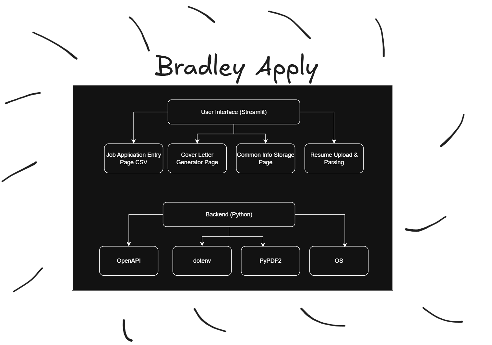

# bradley-apply

A personal job application assistant built with Python and Streamlit.

Bradley Apply helps you track job applications, generate custom cover letters using OpenAI, and manage your commonly used application details — all from a simple local interface.

---

## 🧭 Project Flow



---

## 🚀 Features

- 📄 Track job applications in a CSV file
- ✍️ Generate tailored cover letters using OpenAI
- 📁 Upload your resume to extract key info
- 🗂️ Save and reuse common fields (e.g., start dates, reference numbers)
- 🎛️ Clean and intuitive Streamlit interface


## Development

Create a new Python virtual environment named `.venv`:

```bash
python3 -m venv .venv
```

use this to activate python lib

```bash
source .venv/bin/activate
```

install the needed lib

```bash
pip install -r requirements.txt
```


use this to run the application
```bash
streamlit run Home.py
```

use this to deactiveate the venv
```bash
deactivate
```